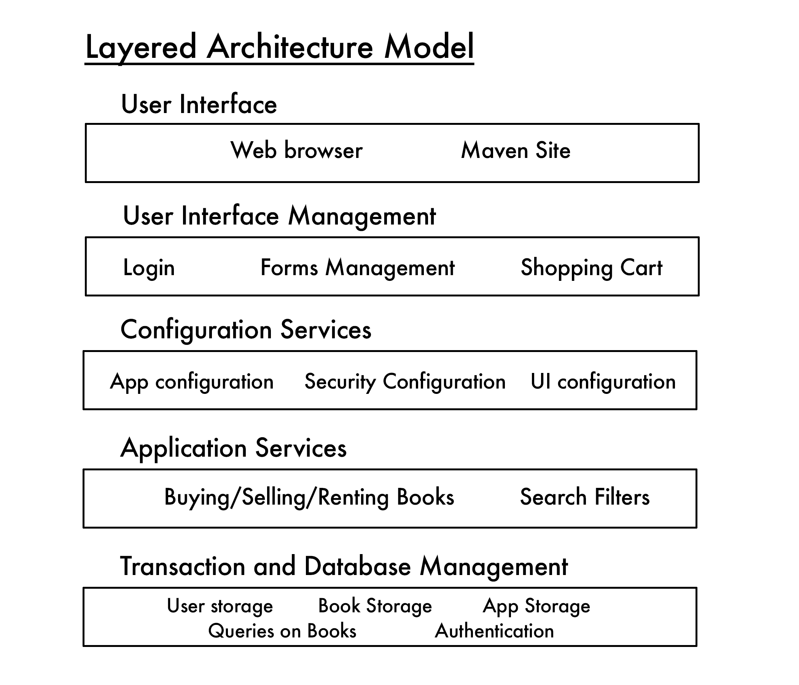

# Maven

Maven is a decentralized library where people can come to search up textbooks to trade or rent. We will have an initial collection of popular textbooks at first to garner users, who can then expand the collection of available books (receiving commission for doing so), or request to rent a book that they need.


## Setup
1. Clone the repository and download [Docker](https://www.docker.com/get-started) (You will also need to enable virtualization on your CPU, how to do this is specific to what kind of motherboard your PC uses and if it's even possible depends on what CPU you have)
2. Once Docker is installed open your terminal and change directories to where you cloned the repository
3. Once there, run the command `docker-compose up`, this will run the local web server along with the database and it should now appear in the desktop program. Now you should be able to access the local host by inputting [localhost:8000](http://localhost:8000) into your browser
4. You may see an error that states that your missing a module named 'corsheaders'. In a separate terminal, run the command `docker exec -it <TheNameOfTheContainer>_web_1 bash`.
5. Once that's done run `pip install django-cors-headers`, to double check that the module is installed
6. While you're in there run the command `python manage.py makemigrations` just in case, it should say "no changes detected"
7. Next, run the command `python manage.py migrate` 
8. Go back to the original terminal you had open and use Ctrl-C to stop it and then run the `docker-compose up` command again and that error should be gone.
## Endpoints
If you would like to make a simple GET request to the database to view its contents, you can do it through jquery. An example:
```javascript
  $.getJSON("http://localhost:8000/users", function(data){  //You can swap users for books and get the output of books in the database
    console.log(data);
  }
```
Remember that the output of the above command will be empty if you don't try registering a user or adding a book first. The contents of the database are local to your machine since its not running on a server but through Docker instead.
### /books
Contains all the books in the database. An example of sending a book to the database:
```javascript
let data = {
  ISBN: "9781524721251"
  title: "Harry Potter and the Sorcerer's Stone"
  author: "J.K. Rowling"
  genre: "Fantasy"
  description: "Harry Potter has no idea how famous he is. That's because he's being raised by his miserable aunt and uncle who are terrified Harry will learn that he's really a wizard, just as his parents were. But everything changes when Harry is summoned to attend an infamous school for wizards, and he begins to discover some clues about his illustrious birthright. From the surprising way he is greeted by a lovable giant, to the unique curriculum and colorful faculty at his unusual school, Harry finds himself drawn deep inside a mystical world he never knew existed and closer to his own noble destiny."
}

$.ajax({
  url: "http://localhost:8000/books",
  data: data,
  type: "POST",
})
```
### /users
Contains all the users in the database. An example of sending a new user to the database:
```javascript
let data = {
  username: "deondre",
  password: "pogreopkerg"
}

$.ajax({
  url: "http://localhost:8000/users",
  data: data,
  type: "POST",
})
```
The key names for the POST request must be exact since those names are what the backend is looking for in each request


## Architectural Decisions



### Important Qualities
For our software product, an important quality is the nonfunctional product characteristics (such as security and performance), since we will be dealing with sensitive information like personal user information and CC’s. Product lifetime is also important since we want to maintain the site and rental services of books for a long time. Finally, consideration of number of users is important, as we want to be able to handle the fluctuating load of users that are visiting and making transactions on the site.

### Technologies Chosen
- Database: We will use a relational database, as we are not dealing with highly complex or variable data (users and book info).
- Platform: We will use a web platform.
- Server: Given the issue of scalability, it would be ideal to design it to run on the cloud.
- Open source: Yes, we will use open source tools for building the user interface and modeling databases.
- Development Tools: As we are using Django for our backend, it is somewhat opinionated, but it can be customized and it is unlikely to be an issue that will limit our architectural choices.
